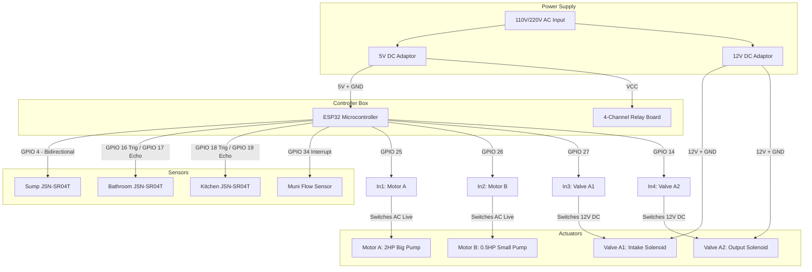

# DIY Construction & Wiring Guide | Waterways

This guide provides step-by-step instructions, electrical schematics, plumbing diagrams, and calibration procedures to construct and install your physical **Waterways Unified Control Panel**.

---

## 1. Bill of Materials (Shopping List)

### Core Electronics
* **Microcontroller**: 1x ESP32 DevKitC V4 (preferably with an external Wi-Fi antenna if tanks are far away).
* **Water Level Sensors**: 3x **JSN-SR04T Waterproof Ultrasonic Sensors** (ideal for tanks; keeps sensitive electronics outside the moisture zone).
* **Actuator Switching**: 1x **4-Channel Relay Board** (5V, opto-isolated, active-low trigger).
* **Water Flow Sensor**: 1x **YF-DN25 (1") or YF-S201 (1/2") Hall-Effect Flow Sensor** (installed on the municipal connection pipe).
* **Power Supplies**:
  * 1x 5V DC 2A Power Supply (for ESP32 and Ultrasonic Sensors).
  * 1x 12V DC 2A Power Supply (for Solenoid Valves and Relay coils).

### Plumbing & Valves
* **Solenoid Valves**: 2x **12V DC Electric Solenoid Valves** (Normally Closed, size matching your main pipe diameter, e.g., 1" or 3/4").
* **Snubber Diodes**: 2x **1N4007 Diodes** (to place in parallel with Solenoid coils to suppress voltage spikes).
* **Bypass Valves**: 3x Manual ball valves (for manual plumbing override in case of system maintenance).

---

## 2. Wiring & Electrical Schematic

Below is the connection layout. Solenoid valves and high-voltage motor relays require isolated power to prevent EMF interference from resetting the ESP32.



### Detailed Pin Connections Table

| ESP32 Pin | Connected Component | Connection Type | Wiring Instructions |
|:---|:---|:---|:---|
| **5V** | DC 5V Power (+) | Power | Connect to 5V power supply output |
| **GND** | DC 5V Power (-) | Power | Common ground for ESP32 and 5V power supply |
| **GPIO 4** | Sump JSN-SR04T Trig & Echo | Digital Input/Output | Connect both Trig & Echo pins of the sump sensor module to GPIO 4 (1-wire mode) |
| **GPIO 16** | Bath JSN-SR04T Trig | Digital Output | Connect to Bathroom sensor Trig pin |
| **GPIO 17** | Bath JSN-SR04T Echo | Digital Input | Connect to Bathroom sensor Echo pin |
| **GPIO 18** | Kitchen JSN-SR04T Trig | Digital Output | Connect to Kitchen sensor Trig pin |
| **GPIO 19** | Kitchen JSN-SR04T Echo | Digital Input | Connect to Kitchen sensor Echo pin |
| **GPIO 34** | Flow Sensor Signal | Digital Input (Interrupt) | Connect to yellow output signal wire of flow sensor |
| **GPIO 25** | Relay Channel 1 | Digital Output | Motor A (Big Pump) Relay control |
| **GPIO 26** | Relay Channel 2 | Digital Output | Motor B (Small Pump) Relay control |
| **GPIO 27** | Relay Channel 3 | Digital Output | Valve A1 (Intake Solenoid) Relay control |
| **GPIO 14** | Relay Channel 4 | Digital Output | Valve A2 (Output Solenoid) Relay control |

---

## 3. Plumbing Layout (Hydraulic Diagram)

Since **Motor A** is used both to draw municipal water into the sump and to pump sump water to the terrace, you must route it using three-way tees and solenoid valves as shown below.

```
                  ======================================
                  ===  MUNICIPAL SOURCE PLUMBING  ===
                  ======================================
                                    |
                                    v (Flow Sensor)
                                    |
                             [Manual Bypass 1]
                                    |
                                    +-----------------+
                                    |                 |
                                    |                 |
                                    |                 v
                                    |         [Valve A1: Intake]
                                    |         (LOW = Outside, HIGH = Sump)
                                    v                 |
                            +---------------+         |
                            | UNDERGROUND   |         v
                            | RESERVOIR     |------>[PUMP INTAKE]
                            | (SUMP)        |
                            +---------------+       [MOTOR A]
                                    |                   |
                                    |                   v
                                    |              [PUMP OUTPUT]
                                    |                   |
                                    |                   v
                                    |         [Valve A2: Output]
                                    |         (LOW = Sump, HIGH = Terrace)
                                    |            /             \
                                    |           /               \
                                    |          /                 \
                                    |     (LOW)                 (HIGH)
                                    v        v                     v
                                    +--------+             [Manual Bypass 2]
                                                                   |
                                                                   v
                                                          [TERRACE BATH TANKS]
```

### Flow Selector State Logic
1. **State 1: Draw municipal water to Sump**:
   * **Valve A1 (Intake)**: De-energized (LOW) $\rightarrow$ Open path: Municipal connection $\rightarrow$ Pump Intake.
   * **Valve A2 (Output)**: De-energized (LOW) $\rightarrow$ Open path: Pump Output $\rightarrow$ Sump.
   * **Motor A**: ON.
2. **State 2: Pump Sump water to Terrace Bathroom Tanks**:
   * **Valve A1 (Intake)**: Energized (HIGH) $\rightarrow$ Open path: Sump output $\rightarrow$ Pump Intake.
   * **Valve A2 (Output)**: Energized (HIGH) $\rightarrow$ Open path: Pump Output $\rightarrow$ Terrace.
   * **Motor A**: ON.
3. **State 3: Standby / System OFF**:
   * **Valve A1 & Valve A2**: De-energized.
   * **Motor A**: OFF.

---

## 4. Step-by-Step Construction Plan

### Step 1: Install Sensors in Tanks
1. Drills a 22mm hole in the top lid of each tank (Sump, Bathroom, Kitchen).
2. Insert the waterproof JSN-SR04T ultrasonic transducer probe through the hole facing down. Ensure the probe is positioned flat/horizontal, pointing straight down at the bottom of the tank (avoid installing close to the walls, as echo reflections from tank ribs or walls will distort readings).
3. Connect the transducer cable to the JSN-SR04T electronic receiver board. Mount the board outside the tank inside a waterproof junction box (IP65/IP66 rated) to protect it from moisture.

### Step 2: Assemble the Control Panel Box
1. Mount the ESP32, 5V power supply, 12V power supply, and 4-Channel Relay board inside a plastic electrical box.
2. Wire the low-voltage sensor lines (Trig, Echo, Flow) to the ESP32 pins using shielded cabling if the wire length exceeds 2 meters. This prevents electromagnetic interference.
3. Wire the 12V DC power lines to the solenoids via the Relay contacts.
4. **CRITICAL STEP: Flyback Diode Installation**: Connect a 1N4007 diode in parallel directly across the terminals of each solenoid valve coil. The silver line (cathode) of the diode must face the positive (+12V) wire. This absorbs the high voltage inductive kickback when the relay cuts power, protecting the ESP32 from freezing or resetting.

### Step 3: Calibrate the Sensor Heights
For the automation code to know what percentage of water is in the tank, you must calibrate the dimensions.
1. Measure the distance from the sensor probe face down to the very bottom of the empty tank (e.g. 120cm). Set this as `BATH_HEIGHT_CM` in the code.
2. Fill the tank completely and measure the distance from the water line up to the sensor face (e.g. 10cm). Set this as `SENSOR_OFFSET_CM`.
3. Update the values in the [esp32_firmware.ino](file:///e:/workspace/waterways/esp32_firmware.ino) parameters block.

### Step 4: Flash Code & Live Test
1. Connect the ESP32 to your computer and flash the firmware using the Arduino IDE.
2. Power up the panel. On your mobile phone or computer, scan for Wi-Fi networks and connect to:
   * **SSID**: `Waterways_Control_Panel`
   * **Password**: `waterways2026`
3. Once connected, open `http://192.168.4.1/api/status` in your browser to verify sensor telemetry is loading correctly.
4. Open the hosted local webpage (`http://192.168.31.148:8080/index.html`) on your computer or phone, toggle the mode to **Manual**, and test the click actuators (Valves and Motors). Verify that the flow indicators line up and move in the correct directions.
